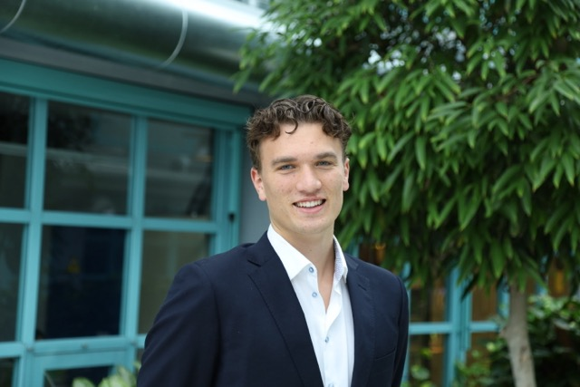

  

# Fredrik Almnes 👋

Hei! Jeg er Fredrik

🎓 Masterstudent i datateknologi @ NTNU (Trondheim) — startet 2025

🤖 Interessert i kunstig intelligens, maskinlæring og å bygge smarte systemer

🌱 Alltid på jakt etter nye prosjekter der data og teknologi møtes

---

## 🚀 Prosjekter

| Prosjekt | Beskrivelse | Teknologier | Lenke |
|---|---|---|---|
| NBA ML Betting | ML-modell som predikerer utfall i NBA-kamper og foreslår value bets | Python, scikit-learn, Pandas | [GitHub](https://github.com/FredAlmnes/Nba-ML-betting) |
| Nottveit Holding AS | Nettside for å stemme frem hvem som fortjener en promosjon | TypeScript | [GitHub](https://github.com/FredAlmnes/Nottveit-Holding-AS) |
| Wallstreet App | Nettside til kollektivet | JavaScript | [GitHub](https://github.com/FredAlmnes/wallstreet-app) |

---

## 🔧 Akkurat nå jobber jeg med

- Videreutvikling av NBA ML-modellen (mer data + bedre treningspipeline)
- Lærer meg mer om dyp læring og nevrale nettverk
- Bygger opp en solid prosjektportefølje gjennom studiene

---

## 🛠️ Teknologier jeg bruker

---

## 📫 Kontakt

- LinkedIn: [fredrik-almnes](https://www.linkedin.com/in/fredrik-almnes-a36a60305/)
- GitHub: [@FredAlmnes](https://github.com/FredAlmnes)

---

Takk for at du sjekker ut profilen min! 🚀
